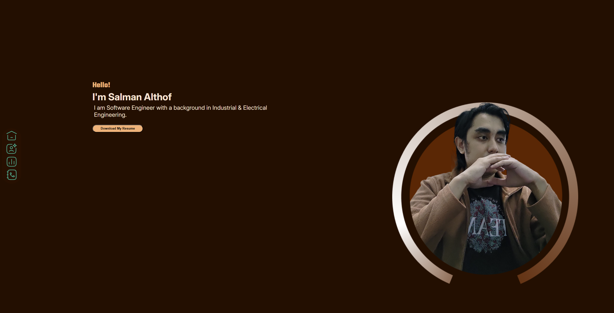
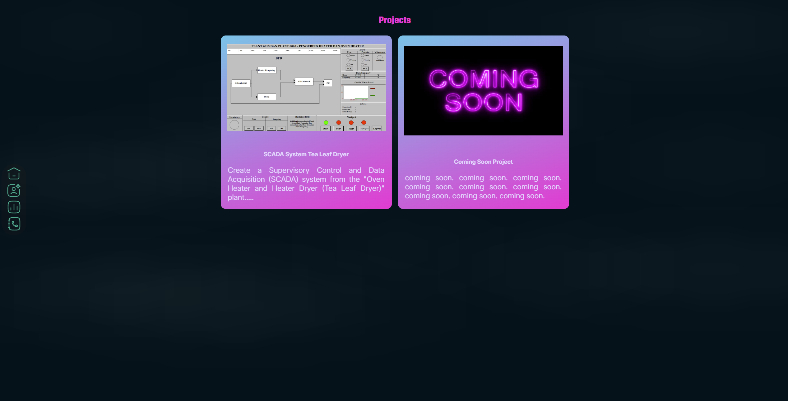

# Project Milestone 1

## Overview
This is a personal portfolio website showcasing my skills, education, work experience, and projects. The website is designed to provide an overview of my background as a Industrial Engineer and electronic engineer with expertise in programming and industrial automation. Screenshot website:
 <br>
Deploy Website:<br>
github: https://revou-fsse-feb25.github.io/milestone-1-Salthof28/ <br>
netlify: https://zingy-stroopwafel-4d6f42.netlify.app/

## Features Implemented
- **Navigation Bar**: Allows users to easily navigate between section.
- **about Me Section**: Displays a brief introduction about my professional background.
- **Work Experience Section**: Highlights my work experience with responsibilities and achievements.
- **Skills Section**: Showcases technical skills with corresponding icons.
- **Responsive Design**: The website is mobile-friendly and adapts to different screen sizes.
- **Smooth Animations**: Enhances user experience with transition effects.
- **Project Section**: Lists personal and professional projects upon future (Project Coming soon)
- **Contact Form**: Allows users to send messages via a simple contact form. (backend still develop) :construction:

## Technologies Used
- **HTML5**: Structure of the website.
- **CSS3**: Used for styling and layout.
- **Flexbox & Grid**: Ensures a responsive design.
- **Media Queries**: Optimizes the website for different devices.
- **CSS Transitions & Animations**: Enhances UI/UX.

## How to Use
1. clone this repository:
```sh
git clone https://github.com/revou-fsse-feb25/milestone-1-Salthof28.git
```
2. Open index.html in a browser to view the website.

## Future Enhancements
- Implement JavaScript for form validation and interactivity

## Author
:bulb: Salman Althof